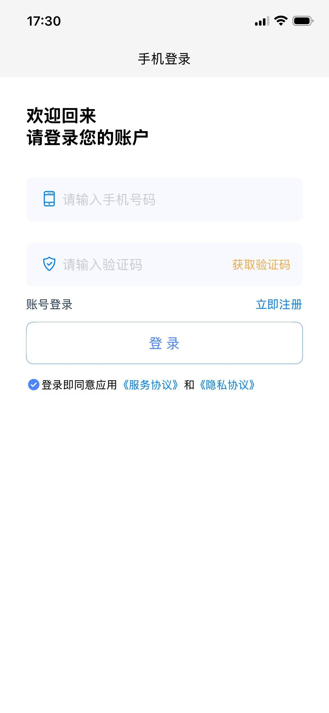
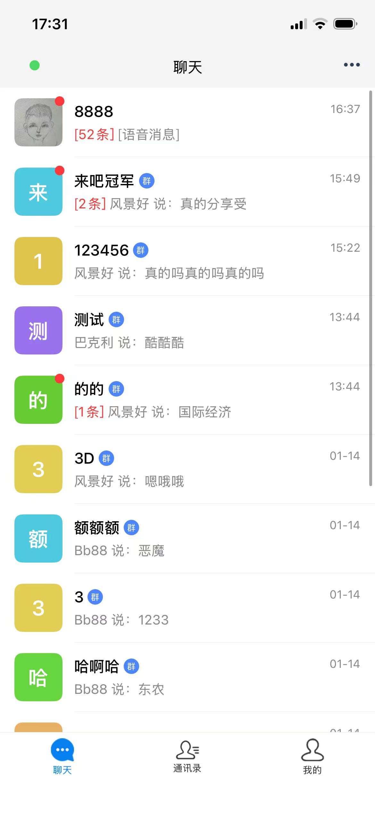
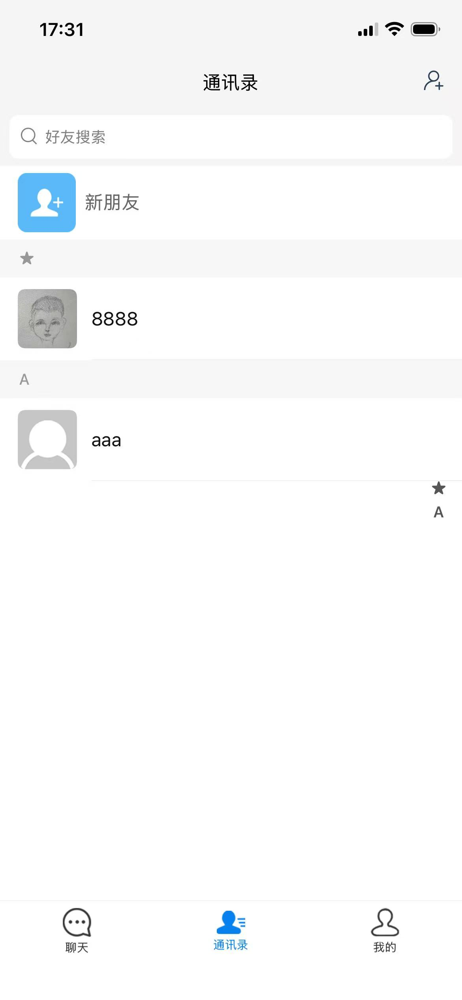
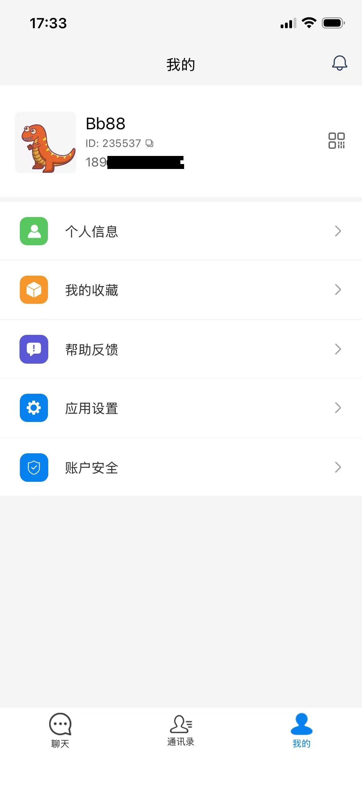
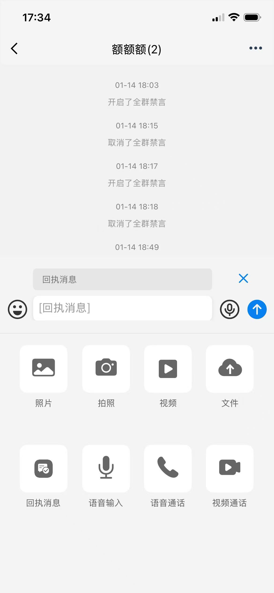
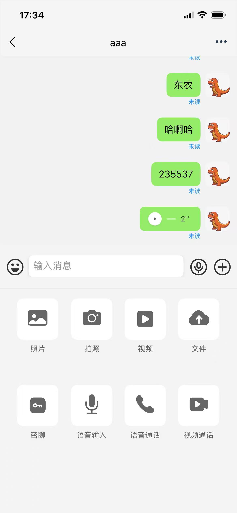
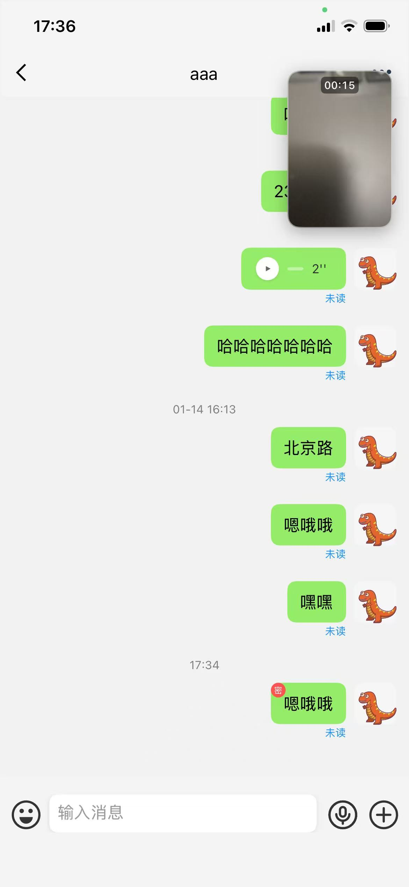

# uniappx-um-im
uniappx 安卓和ios原生聊天软件
通讯录，会话页，语音通话，视频通话等，全采用原生代码编写，你只需要集成uni插件（也支持uniapp集成）即可。经过深度优化，app决不丢失消息。
项目主要uniappx前端 + 服务端 + 后台

# 项目演示1

  
  
  

# 项目演示2

  
  
  

# 项目演示3

  
  
  

# 联系作者
Q: 279652989
